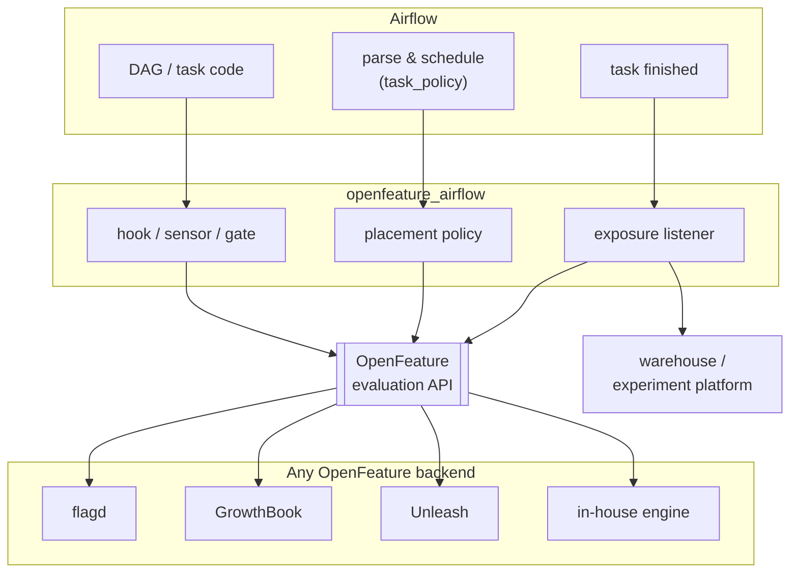

<div align="center">

# airflow-provider-openfeature

**Feature flags for Apache Airflow.** Ramp a change across your DAGs, measure it, and revert with a
flag, not a redeploy.

[](https://github.com/1fanwang/airflow-provider-openfeature/actions/workflows/ci.yml)
[](https://github.com/1fanwang/airflow-provider-openfeature/blob/main/LICENSE)

[](https://github.com/1fanwang/airflow-provider-openfeature/blob/main/pyproject.toml)
[](https://airflow.apache.org)
[](https://openfeature.dev)
[](https://github.com/astral-sh/ruff)
[](https://github.com/1fanwang/airflow-provider-openfeature/blob/main/CONTRIBUTING.md)
[](https://deepwiki.com/1fanwang/airflow-provider-openfeature)
[](https://codecov.io/gh/1fanwang/airflow-provider-openfeature)
[](https://securityscorecards.dev/viewer/?uri=github.com/1fanwang/airflow-provider-openfeature)
[](https://sonarcloud.io/summary/new_code?id=1fanwang_airflow-provider-openfeature)

</div>

A platform team moves a **subset** of tasks to a different pool, queue, or executor, ramps a worker or
executor migration, or flips a kill switch mid-incident, all centrally, without touching anyone's DAG.
A DAG author gates a code path or A/B-tests a model inside a task. Both go
through [OpenFeature](https://openfeature.dev), so it works with the flag backend you already run:
[flagd](https://flagd.dev), [LaunchDarkly](https://launchdarkly.com), [GrowthBook](https://www.growthbook.io),
[Unleash](https://www.getunleash.io), [Statsig](https://statsig.com), or an in-house engine.

It installs as an ordinary pip package and plugs into two extension points Airflow and OpenFeature
already expose: an Airflow [cluster policy](https://airflow.apache.org/docs/apache-airflow/stable/administration-and-deployment/cluster-policies.html)
and an OpenFeature provider. So it doesn't fork Airflow, patch the scheduler, or make you rewrite a
DAG, and it stays off until you switch it on in config.

<p align="center">
  
</p>

<p align="center">
  <b><a href="https://ofopenfeature780983.eastus.cloudapp.azure.com/">▶ Try the live demo</a></b> &mdash; a real Airflow 3.x and a real <a href="https://www.getunleash.io">Unleash</a> backend. Flip a flag, watch tasks change pool. No install, no login.
</p>

## Start here

Two ways in, both on real Airflow. Or skip the setup and
[poke at the live demo](https://ofopenfeature780983.eastus.cloudapp.azure.com/) first.

**You run the Airflow platform.** Install the provider, turn the policy on, and move a subset of DAGs to a
different pool, queue, or executor from a flag. Ramp a worker or executor migration, or flip a kill switch
mid-incident, without editing anyone's DAG. The
[getting-started walkthrough](https://github.com/1fanwang/airflow-provider-openfeature/blob/main/docs/getting-started.md)
runs the whole thing on a local Airflow in about 5 minutes.

**You write DAGs.** Gate a code path or A/B a model inside a task with one call, no platform access needed.
See [Gate a task](#gate-a-task-or-measure-an-outcome) and the runnable
[example DAGs](https://github.com/1fanwang/airflow-provider-openfeature/tree/main/example_dags).

## Why you need it

Feature flags are the standard way to change software behavior at runtime without shipping code. This
brings the same four moves to data pipelines:

- **Ramp, don't flip.** Roll a change out to 1% of runs, then 10%, then 100%, checking each step
  instead of switching everything at once.
- **Experiment.** A/B two implementations (a model version, a join strategy, a new library) across a
  subset of runs and measure which wins, rather than guessing.
- **Kill switch.** Turn a misbehaving feature off during an incident with a flag change, not a redeploy.
- **Target.** Enable something for one team, tenant, or dataset before everyone else.

Those are the standard [toggle categories](https://martinfowler.com/articles/feature-toggles.html)
(release, experiment, ops, permission). The Airflow-specific part: the same flag can also move a task's
`pool`, `queue`, or `executor`, so you canary infrastructure (a worker migration, a new executor) the
same way you canary a feature. Container-canary tools like
[Argo Rollouts](https://argo-rollouts.readthedocs.io/en/stable/) and [Flagger](https://flagger.app/)
shift HTTP traffic between versions and, by their own docs, don't handle queue workers; Airflow
schedules from a pull queue, so a scheduler-level flag is how you ramp a subset of DAGs.

## What you get

- **Move where and how tasks run.** A cluster policy reads a flag and sets a task's pool, queue, executor, or priority for a chosen subset of DAGs, at parse time. No DAG edits.
- **Ramp and revert live.** Change a percentage in your backend. No redeploy, no scheduler restart.
- **Any backend.** [flagd](https://flagd.dev), [LaunchDarkly](https://launchdarkly.com), [GrowthBook](https://www.growthbook.io), [Statsig](https://statsig.com), [Unleash](https://www.getunleash.io), or an in-house engine, through [OpenFeature](https://openfeature.dev). Switch backends without code changes.
- **Measure the result.** One call records the outcome to your experiment platform ([Statsig](https://statsig.com), [GrowthBook](https://www.growthbook.io)) or your warehouse ([OpenTelemetry](https://opentelemetry.io), [Grafana](https://grafana.com)).
- **Safe to install.** The policy and listener do nothing until you turn them on in config.

## See it run

Airflow decides how each task runs from a few settings: its
[**pool**](https://airflow.apache.org/docs/apache-airflow/stable/administration-and-deployment/pools.html)
(a named cap on how many tasks run at once), its
[**queue**](https://airflow.apache.org/docs/apache-airflow/stable/core-concepts/executor/celery.html)
(which set of workers picks the task up), and its
[**executor**](https://airflow.apache.org/docs/apache-airflow/stable/core-concepts/executor/index.html)
(whether the task runs on a shared worker or gets its own
[Kubernetes pod](https://airflow.apache.org/docs/apache-airflow-providers-cncf-kubernetes/stable/kubernetes_executor.html)).
Normally you change these by editing DAGs or redeploying, and the change hits every DAG at once.

**Change them with a flag instead, for a subset of DAGs**: the ones you pick, by name, by
team, or by a percentage you ramp. A
[cluster policy](https://airflow.apache.org/docs/apache-airflow/stable/administration-and-deployment/cluster-policies.html)
reads the flag and applies the setting to that subset, so there is no rollout logic in the DAG itself:

```python
# a large fan-out you would rather move a few at a time (full DAG in example_dags/)
with DAG("features_pipeline", schedule=None, start_date=datetime(2024, 1, 1)) as dag:
    PythonOperator.partial(task_id="process", python_callable=build).expand(op_args=shards)
```

Say you want to try the KubernetesExecutor (each task runs as its own pod) on a handful of DAGs before
moving everything to it. Set `airflow.task.executor` to that executor for the subset; those tasks run as
pods while the rest stay on the shared workers, and turning the flag off puts them back. No redeploy.
That is the safe way to adopt a change like [#68480](https://github.com/apache/airflow/pull/68480) (a
faster pod-creation path): the [case study](https://github.com/1fanwang/airflow-provider-openfeature/blob/main/docs/case-study/) ramps it and measures how long tasks wait
to start, checking for a regression on a real cluster before widening.

**Measure the outcome, don't guess.** The exposure and the result flow back to your platform or
warehouse, so a rollout comes with a number. Here the same policy runs on real Airflow and the lift is
read back from each backend:

<p align="center">
  
</p>

**No vendor lock-in.** The same DAG and policy work on flagd, GrowthBook, Unleash, Statsig, or an
in-house engine through OpenFeature, so you use the backend you already run:

<p align="center">
  
</p>

Commands and raw output for all of this are in [`system_tests/E2E.md`](https://github.com/1fanwang/airflow-provider-openfeature/blob/main/system_tests/E2E.md).

**It works with your setup; it doesn't replace anything.** Your flag backend keeps storing and targeting
the flags. Airflow keeps scheduling. This provider reads the flag through OpenFeature and applies it
where neither of them does: at task placement, in the scheduler. The bundled `FractionalProvider` is
just a no-backend default for the quickstart and tests; in production you point at your real backend and
change nothing else.

## Worked example: canary a pipeline change, end to end

A nightly `revenue_rollup` ETL is missing its SLA. An engineer has a faster rewrite of the aggregation
(`rollup_v2`), but it feeds finance dashboards, so shipping a wrong total to every region at once is not
an option. Put the rewrite behind a flag and ramp it across regions instead.

**In the DAG**, the task reads the flag through this provider, runs the chosen path, and records the
outcome. There is no rollout logic in the DAG; the subset lives in the backend.

```python
from openfeature_airflow.gate import flag_enabled
from openfeature_airflow.measure import track_outcome

use_v2 = flag_enabled("revenue_rollup.use_fast_agg", region)      # the backend decides the subset
result = (rollup_v2 if use_v2 else rollup_v1)(shard)              # run the chosen implementation
track_outcome("rollup_ms", region, value=elapsed_ms, variant="v2" if use_v2 else "v1")
```

**In the backend** (here Unleash), the rollout is a dial. Stickiness on the region key keeps a region
in its group as you raise the percentage. The provider reads any backend identically, so the same flag
drives it from GrowthBook, Statsig, or flagd with a one-line change.

<p align="center">
  
  
</p>

**The result:** ramping 0 → 100% while Airflow reads the flag on each run, `v2` comes out about **89%
faster** and the revenue stays **identical to the cent** at every step. A wrong total would trip the
guardrail, and the fix would be one dial back to 0%, with no redeploy.

<p align="center">
  
</p>

The full walkthrough, plus a second example that canaries the
[KubernetesExecutor](https://airflow.apache.org/docs/apache-airflow-providers-cncf-kubernetes/stable/kubernetes_executor.html)
on a real [kind](https://kind.sigs.k8s.io/) cluster (a flag routes a subset of DAGs to real pods), is in
[**docs/case-study**](https://github.com/1fanwang/airflow-provider-openfeature/blob/main/docs/case-study/).

## Examples

Runnable templates in [`example_dags/`](https://github.com/1fanwang/airflow-provider-openfeature/blob/main/example_dags/); the patterns, mapped to the standard toggle
taxonomy, are in [docs/use-cases.md](https://github.com/1fanwang/airflow-provider-openfeature/blob/main/docs/use-cases.md).

| Use case | What the flag does |
|---|---|
| [Canary a faster rollup](https://github.com/1fanwang/airflow-provider-openfeature/blob/main/example_dags/revenue_rollup_dag.py) | run a rewritten aggregation for a subset of regions, with a revenue-parity guardrail |
| [Airflow 2→3 migration](https://github.com/1fanwang/airflow-provider-openfeature/blob/main/example_dags/migration_2to3_example.py) | route a subset of DAGs onto a 3.x worker pool, ramp, roll back |
| [KubernetesExecutor canary](https://github.com/1fanwang/airflow-provider-openfeature/blob/main/example_dags/kubernetes_executor_rollout_example.py) | shift a subset to concurrent pod creation ([apache/airflow#68480](https://github.com/apache/airflow/pull/68480)), watch, widen |
| [A/B a model](https://github.com/1fanwang/airflow-provider-openfeature/blob/main/example_dags/ab_test_model_example.py) | pick a model variant per run and emit the exposure + outcome |
| Worker / queue migration | move a subset onto a Kubernetes queue gradually |
| Kill switch | revert placement for everyone with one flag change |

## Install

```bash
pip install airflow-provider-openfeature            # core
pip install "airflow-provider-openfeature[flagd]"   # + a backend, e.g. flagd
```

It is a standard PyPI package, so [uv](https://docs.astral.sh/uv/) works the same way:
`uv pip install airflow-provider-openfeature`.

Point OpenFeature at your backend once, in `airflow_local_settings.py` or a bootstrap:

```python
from openfeature import api
from openfeature.contrib.provider.flagd import FlagdProvider

api.set_provider(FlagdProvider(host="localhost", port=8013))
```

Then turn on the piece you want (both default to off):

```ini
[openfeature]
enable_policy = True             # flag-driven pool/queue/executor placement
enable_exposure_listener = True  # record which group each run landed in
```

Bundled adapters for backends whose OpenFeature provider needs a nudge: `providers.growthbook`,
`providers.unleash`, `providers.statsig`, `providers.inhouse` (template for a proprietary engine), and
`providers.fractional` (dependency-free deterministic %-rollout for testing).
[flagd](https://flagd.dev), [LaunchDarkly](https://launchdarkly.com),
[Flagsmith](https://www.flagsmith.com) and [others](https://openfeature.dev/ecosystem/) ship their own
OpenFeature providers; use those directly.

## Gate a task, or measure an outcome

Evaluate a flag anywhere in a task:

```python
from openfeature_airflow.gate import flag_enabled

if flag_enabled("airflow.rollout.new_parser", dag_id):
    ...
```

Record the outcome for analysis (routes to Statsig, GrowthBook, LaunchDarkly, or your warehouse):

```python
from openfeature_airflow.measure import track_outcome

track_outcome("task_duration_ms", f"{dag_id}:{task_id}", value=elapsed_ms, variant=group)
```

See [docs/measurement.md](https://github.com/1fanwang/airflow-provider-openfeature/blob/main/docs/measurement.md) for the per-backend readout.

## Docs

- [Live demo](https://ofopenfeature780983.eastus.cloudapp.azure.com/) (no login) and its [source repo](https://github.com/1fanwang/airflow-provider-openfeature-example): a real Airflow 3.x + Unleash you can flip flags on.
- [Getting started](https://github.com/1fanwang/airflow-provider-openfeature/blob/main/docs/getting-started.md): a 5-minute walkthrough on real Airflow.
- [Running a rollout](https://github.com/1fanwang/airflow-provider-openfeature/blob/main/docs/running-a-rollout.md): the end-to-end loop, and how to read a ramp.
- [Case study](https://github.com/1fanwang/airflow-provider-openfeature/blob/main/docs/case-study/): canary a faster pipeline step end to end, with a real Unleash backend.
- [Use cases](https://github.com/1fanwang/airflow-provider-openfeature/blob/main/docs/use-cases.md): the toggle taxonomy mapped to Airflow, with recipes.
- [Measurement](https://github.com/1fanwang/airflow-provider-openfeature/blob/main/docs/measurement.md): closing the loop with your experiment platform or warehouse.
- [Architecture](https://github.com/1fanwang/airflow-provider-openfeature/blob/main/docs/architecture.md): the flow and the surfaces it registers.
- [Extending](https://github.com/1fanwang/airflow-provider-openfeature/blob/main/docs/extending.md): add a backend.
- [Contributing](https://github.com/1fanwang/airflow-provider-openfeature/blob/main/CONTRIBUTING.md) · [AGENTS.md](https://github.com/1fanwang/airflow-provider-openfeature/blob/main/AGENTS.md).

These docs also build into a site: `pip install -e ".[docs]"` then `mkdocs serve` (or see
[`mkdocs.yml`](https://github.com/1fanwang/airflow-provider-openfeature/blob/main/mkdocs.yml)); `.github/workflows/docs.yml` publishes it to GitHub Pages.

## How it works

Everything goes through the [OpenFeature evaluation API](https://openfeature.dev/specification/), so the
backend is a swap. The package adds three Airflow surfaces, auto-discovered via
[entry points](https://packaging.python.org/en/latest/specifications/entry-points/); the backend
decides which subset each run lands in.



It gives you two independent capabilities, both no-ops until you turn them on in config:

- **Placement policy.** A cluster policy consults a flag and overrides a task's `pool` / `queue` /
  `executor` / `priority_weight` for the chosen subset. A rollout is a backend config change, not a DAG edit.
- **In-DAG evaluation.** The hook, sensor, and gate read a flag for a stable entity inside a task, and
  the exposure listener records which group each run landed in, so you can measure it.

| Surface | Entry point | Purpose |
|---|---|---|
| `OpenFeatureHook`, `FeatureFlagSensor`, `openfeature` connection | `apache_airflow_provider` | evaluate a flag in a task |
| flag-driven placement policy | `airflow.policy` | override `pool`/`queue`/`executor`/`priority_weight` per subset |
| exposure listener | `airflow.plugins` | emit the resolved group for measurement |

The policy reads these well-known flags, keyed on `dag_id:task_id`: `airflow.task.pool`,
`airflow.task.queue`, `airflow.task.executor`, `airflow.task.priority_weight`. Register your own
flag-driven dimensions for any operator attribute (a Spark version, a checkpoint toggle) with
`register_placement`; see [docs/extending.md](https://github.com/1fanwang/airflow-provider-openfeature/blob/main/docs/extending.md). The entity is bucketed
deterministically, so a task lands in the same group every parse until the backend config changes.
[`docs/architecture.md`](https://github.com/1fanwang/airflow-provider-openfeature/blob/main/docs/architecture.md) has the step-by-step ramp and exposure sequence diagrams
and the Airflow version notes.

## Status

Alpha (0.1.0). The API may change before 1.0.

## License

Apache-2.0.
