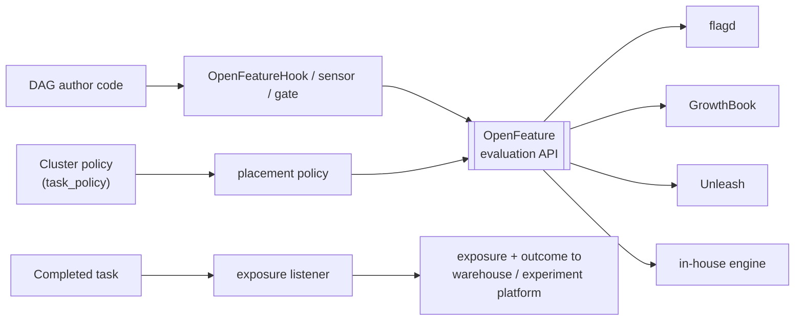

<div align="center">

# airflow-provider-openfeature

**Feature flags for Apache Airflow.** Ship a platform change to 1% of your DAGs, ramp it to 100%,
and roll it back in seconds. No DAG edits, no redeploy.

[](https://github.com/1fanwang/airflow-provider-openfeature/actions/workflows/ci.yml)
[](https://github.com/1fanwang/airflow-provider-openfeature/actions/workflows/publish.yml)
[](LICENSE)

[](pyproject.toml)
[](https://airflow.apache.org)
[](https://openfeature.dev)
[](https://github.com/astral-sh/ruff)
[](CONTRIBUTING.md)

</div>

Migrating workers, moving to a new executor, or turning on a risky behavior usually means editing DAGs
or redeploying, and a bad change hits every pipeline at once. This provider puts those changes behind
a feature flag: a cohort of tasks moves to a canary pool or a new queue, you watch it, and you revert
by flipping the flag. It works with the flag backend you already run, through
[OpenFeature](https://openfeature.dev).

<p align="center">
  
</p>

## Try it in 30 seconds

No Docker, no backend, no running Airflow:

```bash
pip install airflow-provider-openfeature
python examples/quickstart.py
```

It ramps a canary pool from 0% to 100% across 40 DAGs, then flips the flag back to 0 (the kill
switch). That is the animation above. For the same thing against a real DAG and a live backend, follow
the [5-minute getting-started](docs/getting-started.md).

## Why you need it

- **Deployment is not release.** Shipping new code and exposing it to traffic should be separate steps.
  A flag lets you deploy once and roll out gradually.
- **Roll back in seconds.** A bad rollout reverts with a flag change, not a redeploy. Knight Capital
  lost $460M in 45 minutes for want of a kill switch.
- **Container canary tools can't do this.** Argo Rollouts and Flagger shift HTTP traffic between
  versions; by their own docs they don't support queue workers. Airflow schedules from a pull queue, so
  a scheduler-level flag is the way to canary a cohort of DAGs.

## What you get

| | |
|---|---|
| **One flag moves placement** | A cluster policy reads a flag and sets a task's `pool` / `queue` / `executor` / `priority_weight` by cohort. No DAG edits. |
| **Ramp and revert live** | Change a percentage in your backend. No redeploy, no scheduler restart. |
| **Any backend** | flagd, LaunchDarkly, GrowthBook, Statsig, Unleash, or an in-house engine, through OpenFeature. Swap without a rewrite. |
| **Measure the result** | One call records the cohort outcome to your platform (Statsig, GrowthBook) or your warehouse (OTEL/Grafana). |
| **Safe to install** | The policy and listener are no-ops until you turn them on in config. |

## See it run

Same DAG population and one policy, routed identically across five real backends, and the full
assign → run → measure → read-out loop with a measured lift. All on real Airflow 3.2.2; commands and
raw output in [`system_tests/E2E.md`](system_tests/E2E.md).

<p align="center">
  
</p>

<p align="center">
  
</p>

And the KubernetesExecutor canary on a real cluster: a flag routes a DAG cohort to the kubernetes
executor, each routed task runs as a real pod, and ramping the flag grows the cohort live.

<p align="center">
  
</p>

## Examples

Runnable templates in [`example_dags/`](example_dags/); the patterns, mapped to the standard toggle
taxonomy, are in [docs/use-cases.md](docs/use-cases.md).

| Use case | What the flag does |
|---|---|
| [Airflow 2→3 migration](example_dags/migration_2to3_example.py) | route a cohort of DAGs onto a 3.x worker pool, ramp, roll back |
| [KubernetesExecutor canary](example_dags/kubernetes_executor_rollout_example.py) | shift a cohort to concurrent pod creation ([apache/airflow#68480](https://github.com/apache/airflow/pull/68480)), watch, widen |
| [A/B a model](example_dags/ab_test_model_example.py) | pick a model variant per run and emit the exposure + outcome |
| Worker / queue migration | move a cohort onto a Kubernetes queue gradually |
| Kill switch | revert placement for everyone with one flag change |

## Install

```bash
pip install airflow-provider-openfeature            # core
pip install "airflow-provider-openfeature[flagd]"   # + a backend, e.g. flagd
```

Point OpenFeature at your backend once, in `airflow_local_settings.py` or a bootstrap:

```python
from openfeature import api
from openfeature.contrib.provider.flagd import FlagdProvider

api.set_provider(FlagdProvider(host="localhost", port=8013))
```

Then turn on the piece you want (both default to off):

```ini
[openfeature]
enable_policy = True             # flag-driven pool/queue/executor placement
enable_exposure_listener = True  # record which cohort each run landed in
```

Bundled adapters for backends whose OpenFeature provider needs a nudge: `providers.growthbook`,
`providers.unleash`, `providers.statsig`, `providers.inhouse` (template for a proprietary engine), and
`providers.fractional` (dependency-free deterministic %-rollout for testing). flagd, LaunchDarkly,
Flagsmith and others ship their own OpenFeature providers; use those directly.

## Gate a task, or measure an outcome

Evaluate a flag anywhere in a task:

```python
from openfeature_airflow.gate import flag_enabled

if flag_enabled("airflow.rollout.new_parser", dag_id):
    ...
```

Record the outcome for analysis (routes to Statsig, GrowthBook, LaunchDarkly, or your warehouse):

```python
from openfeature_airflow.measure import track_outcome

track_outcome("task_duration_ms", f"{dag_id}:{task_id}", value=elapsed_ms, variant=cohort)
```

See [docs/measurement.md](docs/measurement.md) for the per-backend readout.

## Docs

- [Getting started](docs/getting-started.md): a 5-minute walkthrough on real Airflow.
- [Use cases](docs/use-cases.md): the toggle taxonomy mapped to Airflow, with recipes.
- [Measurement](docs/measurement.md): closing the loop with your experiment platform or warehouse.
- [Architecture](docs/architecture.md): the flow and the surfaces it registers.
- [Extending](docs/extending.md): add a backend.
- [Contributing](CONTRIBUTING.md) · [AGENTS.md](AGENTS.md).

<details>
<summary>How it works</summary>

Everything goes through the OpenFeature evaluation API, so the backend is a swap. The package adds
three Airflow surfaces, auto-discovered via entry points; the backend decides who is in which cohort.



| Surface | Entry point | Purpose |
|---|---|---|
| `OpenFeatureHook`, `FeatureFlagSensor`, `openfeature` connection | `apache_airflow_provider` | evaluate a flag in a task |
| flag-driven placement policy | `airflow.policy` | override `pool`/`queue`/`executor`/`priority_weight` per cohort |
| exposure listener | `airflow.plugins` | emit the resolved cohort for measurement |

The policy reads these well-known flags, keyed on `dag_id:task_id`: `airflow.task.pool`,
`airflow.task.queue`, `airflow.task.executor`, `airflow.task.priority_weight`.

</details>

## Status

Alpha (0.1.0). The API may change before 1.0. A third-party provider, not part of the Apache Airflow
monorepo.

## License

Apache-2.0.
