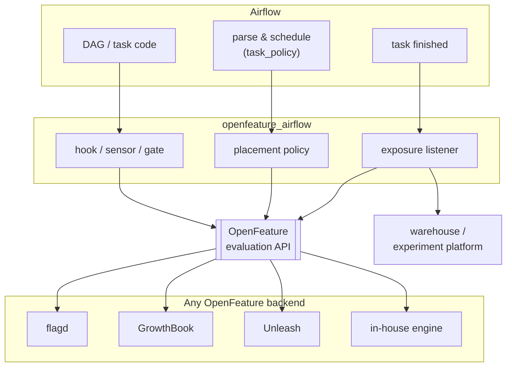
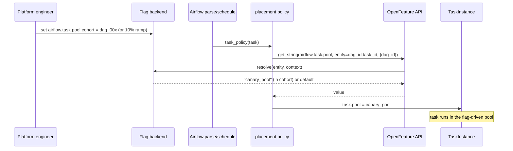
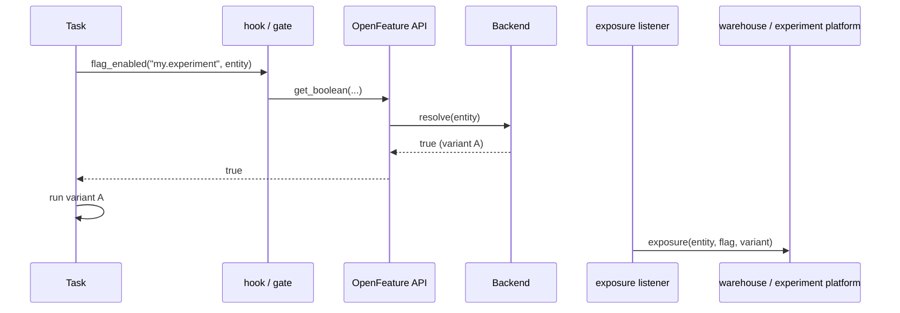

# Architecture

Everything goes through the [OpenFeature](https://openfeature.dev) evaluation API.
This package adds three Airflow surfaces on top of it; the backend decides who is in which cohort, so
swapping flagd for GrowthBook, Unleash, or an in-house engine changes no Airflow code.

## Components

Two independent capabilities:

- **Placement policy** (`policy.py`). A cluster policy consults a flag
  and overrides a task's `pool` / `queue` / `executor` for its cohort. A rollout is a backend config
  change, not a DAG edit.
- **In-DAG evaluation** (`hooks/`, `sensors/`, `gate.py`), read a flag for a deterministic entity
  inside a task, and record the assignment through the exposure listener for measurement.

Both are no-ops until turned on in config, so installing the package changes nothing.

## Progressive delivery: how a ramp reaches a task

The entity is `dag_id:task_id`, bucketed deterministically, so the same task lands in the same cohort
every parse until the backend config changes. Widen or revert by editing the flag; no redeploy.

## In-DAG evaluation and exposure

Exposure is what makes an experiment measurable: the listener records which cohort each run landed in,
so an analysis join lives in whatever platform you already use. On Airflow 2.x the listener fires
worker-side; on 3.x, call `emit_exposure` from the task or policy, since task-instance listeners moved
to the Task SDK.

## Airflow version notes

- Policy hooks (`airflow.policies.hookimpl`, the `airflow.policy` entry point) exist on 2.6+ and 3.x.
- `pool` and `queue` overrides work on 2.x and 3.x. Per-task `executor` needs 2.10+/3.x.
- The package depends on `apache-airflow-providers-common-compat` so the hook and sensor import the
  right base classes across versions.
