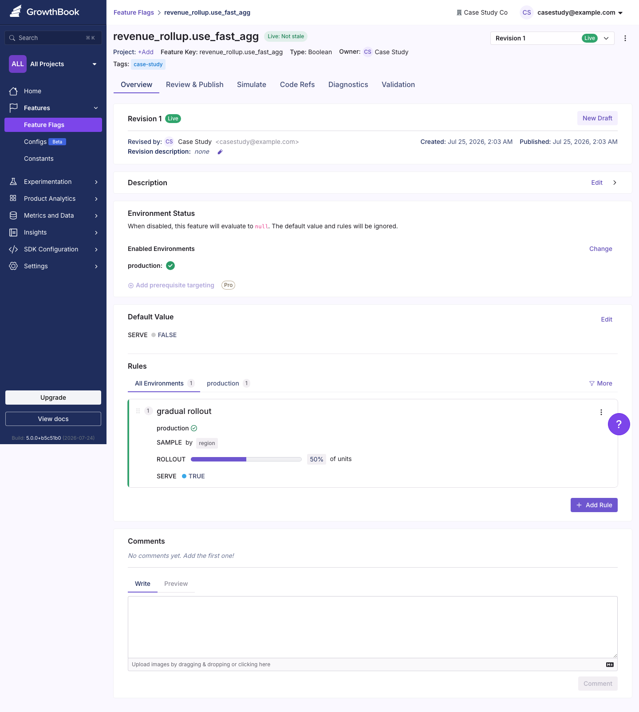
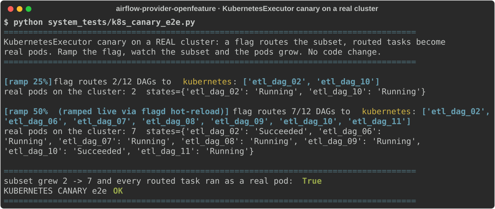

# Case study: canary a faster pipeline step with a feature flag

A worked example on real Airflow with a real feature-flag backend ([Unleash](https://www.getunleash.io)),
start to finish. It
shows the everyday version of what this provider is for: roll a risky pipeline change out gradually,
measure it, and keep the escape hatch.

## The problem

A data team runs a nightly `revenue_rollup` ETL that aggregates raw orders into daily revenue per
region. Traffic grew, the job is slow, and it keeps missing its SLA. An engineer rewrote the
aggregation to be much faster (`rollup_v2`). The numbers look right in a notebook, but this feeds
finance dashboards: shipping a wrong total to every region at once is not an option, and "revert" today
means a code change, a review, and a redeploy while the pipeline is already late.

## The idea

Put `v2` behind a feature flag and ramp it across regions instead of flipping it everywhere.

- Start at 0%: every region stays on the trusted `v1`.
- Raise the dial: a few regions run `v2`, the rest stay on `v1`.
- At each step, measure two things: the runtime, and whether `v2`'s revenue matches `v1` to the cent.
- If a region's numbers ever diverge, set the flag back to 0%. No redeploy.

The flag lives in Unleash. Airflow reads it through this provider, so the rollout is a dial in a UI,
not an edit to the DAG.

## Setup

**The flag** is a normal Unleash feature with a gradual-rollout strategy, stickiness on the region key
so a region stays in its group as you ramp.


The same flag, the same 50%-by-region rollout, configured in a second real backend (GrowthBook). The
provider reads either one identically, so switching backends is a one-line change:



**The pipeline** ([`pipeline.py`](https://github.com/1fanwang/airflow-provider-openfeature/blob/main/system_tests/case_study/pipeline.py)) generates a realistic
orders dataset (480k rows across 12 regions and 30 days) and has both rollups. They return identical
numbers; `v2` just does far fewer passes:

```python
def rollup_v1(rows):   # original: rescans the shard per (region, date) group
    keys = {(r["region"], r["order_date"]) for r in rows}
    return {(region, date): _revenue(rows, region, date) for region, date in keys}

def rollup_v2(rows):   # rewrite: one pass, dict accumulation
    out = defaultdict(float)
    for r in rows:
        ...
    return dict(out)
```

**The wiring** is the gate: each region reads the flag, runs the matching rollup, and records the
outcome for measurement.

```python
from openfeature_airflow.gate import flag_enabled
from openfeature_airflow.measure import track_outcome

use_v2 = flag_enabled("revenue_rollup.use_fast_agg", region, region=region)
result = (rollup_v2 if use_v2 else rollup_v1)(shard)
track_outcome("rollup_ms", region, value=elapsed_ms, variant="v2" if use_v2 else "v1", region=region)
```

## Running the ramp

[`run_case_study.py`](https://github.com/1fanwang/airflow-provider-openfeature/blob/main/system_tests/case_study/run_case_study.py) turns the Unleash dial from 0%
to 100%, and at each step evaluates every region through the provider, runs its real shard, and checks
the guardrail (`v2 == v1`).


The result at every step: `v2` runs about **89% faster** (v1 ~77 ms per region, v2 ~9 ms), and the
revenue is **identical to the cent**. Because the rollout percentage is a per-region probability, the
enabled set grows in steps as you raise the dial (0, then 4, then 10, then all 12 regions), and a
region never leaves the group once it is in it.

If `v2` had produced a wrong total for any region, the guardrail would have caught it and the fix is
one dial back to 0% in the Unleash UI, with no code change and no redeploy.

## Reproduce it

```bash
# 1. bring up Unleash and create the flag
docker compose -f system_tests/docker-compose.unleash.yml up -d
python system_tests/case_study/setup_unleash_flag.py 50   # creates the flag at a 50% rollout

# 2. run the ramp
pip install airflow-provider-openfeature UnleashClient
PYTHONPATH="src:system_tests/case_study" python system_tests/case_study/run_case_study.py
```

## What it generalizes to

The step here is an aggregation rewrite, but the shape is the same for any risky pipeline change: a new
model version, a different join strategy, a library upgrade, a move to a new pool or executor. Ramp it
across a subset, measure the outcome, keep the numbers honest with a guardrail, and revert with a flag
instead of a deploy. Swap Unleash for [flagd](https://flagd.dev), [GrowthBook](https://www.growthbook.io),
[Statsig](https://statsig.com), [LaunchDarkly](https://launchdarkly.com), or an in-house engine without
touching the DAG, since it all goes through [OpenFeature](https://openfeature.dev).

---

## Second example: canary the KubernetesExecutor on a real cluster

Same shape, applied to the platform itself instead of a DAG's logic.

**The problem.** Moving a subset of DAGs onto the
[KubernetesExecutor](https://airflow.apache.org/docs/apache-airflow-providers-cncf-kubernetes/stable/kubernetes_executor.html)
(each task runs as its own pod) is an infrastructure change you want to ramp, not flip: turn it on for a
few DAGs, confirm the pods run, then widen. An executor change like
[apache/airflow#68480](https://github.com/apache/airflow/pull/68480) (concurrent pod creation) is the
kind of thing you'd adopt this way.

**The check.** Gate the executor behind `airflow.task.executor` and route a subset of DAGs to it with a
flag resolved live from flagd. For each routed DAG the executor's own action — launch a pod on the
cluster — runs for real, and the pod state is read back with `kubectl`. Ramp the flag and watch the
subset, and the pod count, grow with no code change.

<p align="center">
  
</p>

On a real [kind](https://kind.sigs.k8s.io/) cluster the flag routes 2/12 DAGs to real pods (state
`Running`); a live ramp to 50% grows it to 7/12, every routed task runs as a real pod, and emptying the
flag reverts it. No redeploy. The reproducer is
[`k8s_canary_e2e.py`](https://github.com/1fanwang/airflow-provider-openfeature/blob/main/system_tests/k8s_canary_e2e.py).

